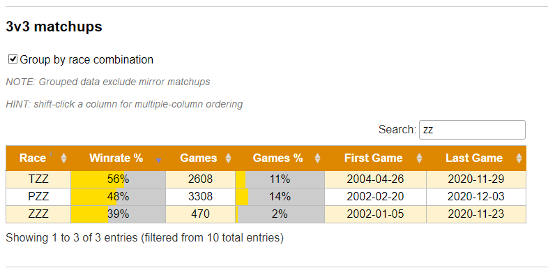

# repmastered.app winrate sorting

## Description

Improves matchup tables (on a map page) with abilities to sort and group data.

## Screenshot

## How to install the script

1. Install one of these browser extensions: [Violentmonkey](https://violentmonkey.github.io/get-it/) / [Greasemonkey](https://www.greasespot.net/) / [Tampermonkey](https://tampermonkey.net/)
2. Go to the script [page](https://greasyfork.org/en/scripts/417840-repmastered-app-winrate-sort)
3. Press **Install this script** button
4. Confirm the installation

## License

This work is free. You can redistribute it and/or modify it under the terms of the [Do What The Fuck You Want To Public License, Version 2](http://www.wtfpl.net/about/), as published by Sam Hocevar. See the [LICENSE](./LICENSE) file for more details.